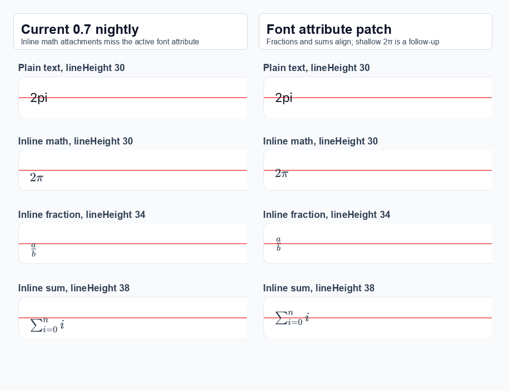
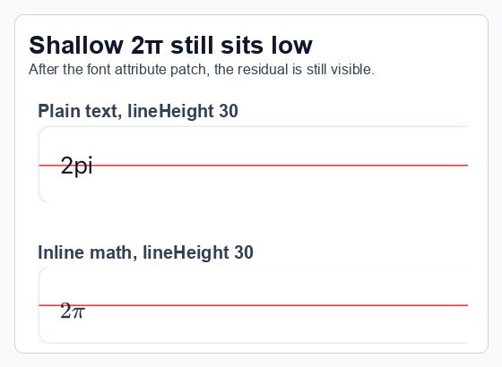

# react-native-enriched-markdown inline math repro

Minimal iOS reproduction for inline math alignment behavior in `react-native-enriched-markdown`.

It renders small fixed-height rows with red center lines so inline math placement can be compared against plain text and other formulas.

## What this shows

The app is useful for two related iOS checks:

1. **Attachment font attributes**: inline math is rendered as an `NSTextAttachment`. In the current `0.7` nightly, the attachment string is missing `NSFontAttributeName`, so the package's paragraph line-height baseline-offset pass does not apply consistently to math attachments.
2. **Shallow formula residual**: after the font-attribute fix, larger formulas such as fractions and sums align much better, but shallow zero-depth formulas such as `$2\pi$` can still look optically low compared with plain text.

## Run

```sh
npm install
npm run ios
```

The repro currently uses:

- `react-native-enriched-markdown@0.7.0-nightly-20260627-4e5ceb7c3`
- `react-native@0.85.3`
- `expo@~56.0.12`

The nightly version is intentional: current 0.7 code applies `applyBaselineOffset(...)` after `applyLineHeight(...)` in `ios/renderer/ParagraphRenderer.m`. That helper in `ios/utils/ParagraphStyleUtils.m` reads `NSFontAttributeName` to compute the font line height and add `NSBaselineOffsetAttributeName`. This repro focuses on the inline math attachment missing that font attribute, not the older pre-0.7 line-height behavior.

## Screenshots

### Font-attribute comparison

This compares the current nightly with the same app after adding the active `NSFontAttributeName` to the inline math attachment string.



### Shallow formula residual

This highlights the remaining `$2\pi$` visual offset after the font-attribute patch. It is separate from the missing-font-attribute issue.


